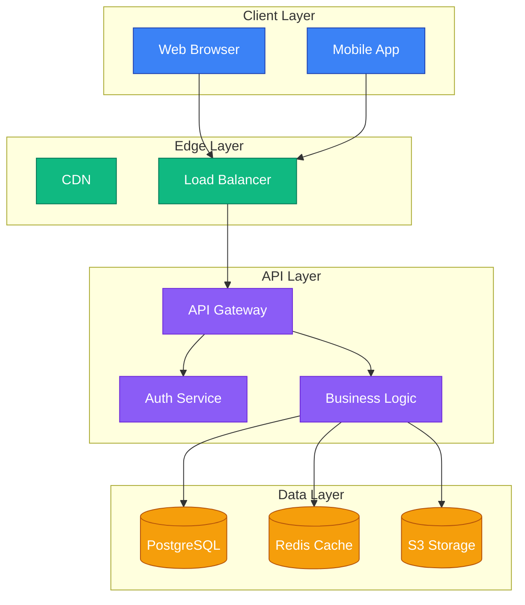
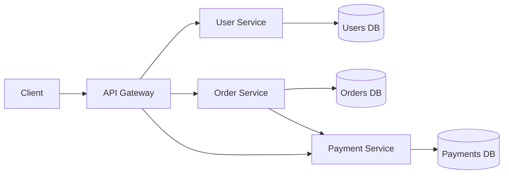
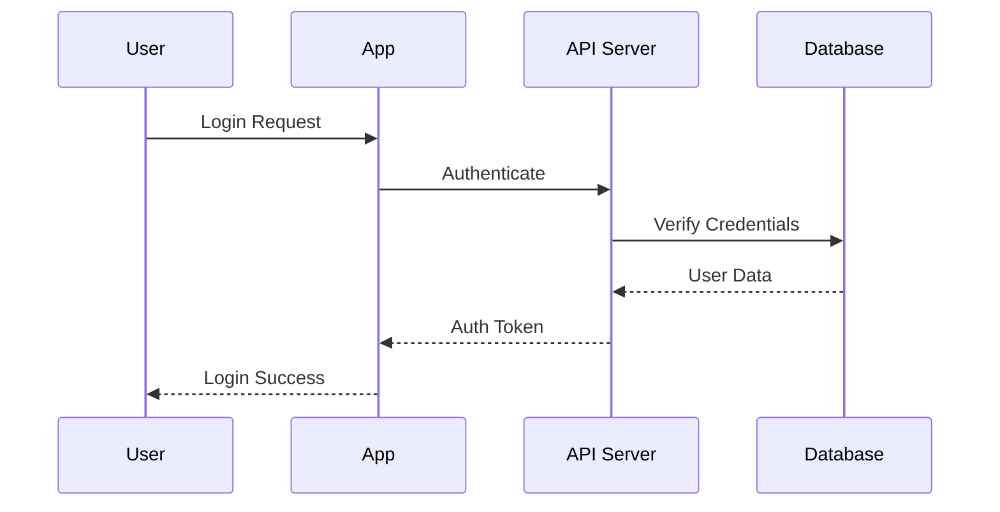
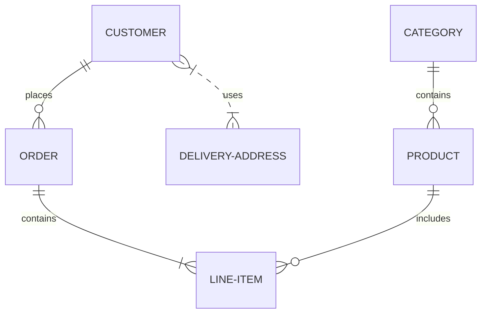

# 🎨 Architecture Diagram Feature

## Overview

DraftDeckAI now includes **enhanced Mermaid diagram support** for generating professional architecture diagrams, flowcharts, sequence diagrams, and more in your presentations.

## Features

### ✨ What's New

- **Enhanced Mermaid Prompts**: AI now generates better-structured architecture diagrams with proper layering
- **Subgraph Support**: Automatic grouping of related components (Frontend, Backend, Database, etc.)
- **Styling Classes**: Consistent color schemes using `classDef` for professional appearance
- **Multiple Diagram Types**: Flowchart, Sequence, Class, State, ER, Journey, Gantt, Mindmap, and more
- **Responsive Rendering**: Diagrams scale beautifully on mobile and desktop
- **Theme Integration**: Diagrams adapt to light/dark/colorful themes automatically

### 📊 Supported Diagram Types

| Type | Use Case | Example |
|------|----------|---------|
| `flowchart TD/LR` | System architecture, processes | Top-down or left-right flows |
| `sequenceDiagram` | API interactions, user flows | Request/response timelines |
| `classDiagram` | OOP structures, code design | Class hierarchies |
| `erDiagram` | Database schemas | Entity relationships |
| `stateDiagram-v2` | State machines | Status transitions |
| `journey` | User experience flows | Customer journeys |
| `gantt` | Project timelines | Task scheduling |
| `mindmap` | Idea organization | Hierarchical brainstorming |
| `gitGraph` | Version control workflows | Branching strategies |

## Architecture Diagram Examples

### 1. Modern Web Application Architecture



### 2. Microservices Architecture



### 3. Sequence Diagram - Authentication Flow



### 4. Database Schema (ER Diagram)



## How It Works

### 1. AI Generation Pipeline

```
User Prompt → Strategist Agent → Coder Agent → Mermaid Diagram
     ↓              ↓                 ↓              ↓
  Topic &      Visual Strategy   JSON Output    Rendered SVG
  Requirements   & Layout Plan   with Mermaid   in Presentation
                               Code
```

### 2. Rendering Process

1. **Dynamic Import**: Mermaid is loaded client-side to avoid SSR issues
2. **Theme Integration**: Colors adapt to presentation theme (light/dark)
3. **Validation**: Syntax checking before rendering
4. **Enhancement**: Automatic styling improvements (shadows, fonts, spacing)
5. **Responsive**: Scales for mobile/desktop viewing

### 3. Quality Checks

The AI ensures:
- ✅ At least 6-8 nodes and 5+ edges
- ✅ Proper subgraph grouping for layered architectures
- ✅ Clear directional flow (TD or LR)
- ✅ Concise labels (1-3 words)
- ✅ No crossing-heavy "spaghetti" graphs
- ✅ Context-aware node names based on slide topic

## Usage

### In Presentations

When generating a presentation with 6+ slides about a technical topic, the AI automatically includes:

1. **UX/User Flow Slide** - Mermaid journey or flowchart
2. **System Architecture Slide** - Mermaid with subgraph layers
3. **Tech Stack Slide** - Mermaid or HTML/Tailwind mockup

### Manual Diagram Creation

You can also create diagrams manually in the diagram editor:

1. Navigate to **Diagram Generator**
2. Choose a template or write custom Mermaid code
3. Preview and export to presentation

## Best Practices

### ✅ DO

- Use `subgraph` blocks for logical grouping
- Keep labels short and descriptive
- Use appropriate node shapes:
  - `[Rectangle]` for processes
  - `{{Database}}` for data stores
  - `([Circle])` for start/end
  - `{Diamond}` for decisions
- Apply `classDef` for consistent styling
- Use `TD` for hierarchical flows, `LR` for sequential flows

### ❌ DON'T

- Create crossing-heavy diagrams
- Use long labels (over 3 words)
- Mix diagram types in one code block
- Forget to start with diagram type (`flowchart TD`, etc.)
- Use hardcoded colors (use theme variables)

## Configuration

### Environment Variables

```bash
# Nebius API for AI generation
NEBIUS_API_KEY=your-api-key-here
NEBIUS_BASE_URL=https://api.tokenfactory.nebius.com/v1/

# Optional: Customize AI model
QWEN_MODEL=Qwen/Qwen3-Coder-480B-A35B-Instruct
```

### Theme Customization

Diagram colors adapt automatically to presentation themes:

```typescript
themeColors={{
  background: tokens.bg,    // --dd-bg
  card: tokens.card,        // --dd-card
  foreground: tokens.fg,    // --dd-fg
  accent: tokens.accent,    // --dd-accent
  border: tokens.border,    // --dd-border
}}
```

## Troubleshooting

### Diagram Not Rendering

**Problem**: "Invalid diagram syntax" error

**Solutions**:
1. Ensure diagram starts with valid type (`flowchart TD`, `sequenceDiagram`, etc.)
2. Check for missing brackets, quotes, or semicolons
3. Validate node IDs are unique
4. Avoid special characters in labels (use quotes)

### Crossings/Spaghetti Layout

**Problem**: Too many crossing lines

**Solutions**:
1. Use `TD` (top-down) instead of `LR` for hierarchical data
2. Group related nodes in `subgraph` blocks
3. Reduce connections between distant nodes
4. Reorder nodes to minimize crossings

### Colors Not Matching Theme

**Problem**: Diagram uses default colors

**Solutions**:
1. Use `classDef` without hardcoded colors
2. Let the renderer apply theme colors automatically
3. Avoid inline `fill:` attributes in Mermaid code

## Technical Details

### Dependencies

- **mermaid**: `^11.9.0` - Diagram rendering engine
- **openai**: `^6.15.0` - AI API client (Nebius-compatible)

### File Structure

```
components/
├── diagram/
│   ├── diagram-preview.tsx      # Mermaid renderer
│   ├── diagram-templates.tsx    # Pre-built templates
│   └── diagram-generator.tsx    # Editor UI
└── presentation/
    ├── real-time-generator.tsx  # Main presentation view
    └── presentation-preview.tsx # Preview component

lib/
└── qwen-code-presentation.ts    # AI generation logic
```

### Render Pipeline

```
Mermaid Code
    ↓
Validation (diagram type check)
    ↓
mermaid.initialize({ theme: 'base', themeVariables: {...} })
    ↓
mermaid.render(id, code) → SVG
    ↓
Enhancement (fonts, shadows, spacing)
    ↓
Responsive container (flexbox centering)
    ↓
Final Display
```

## Future Enhancements

- [ ] Custom node styling editor
- [ ] Export diagrams as PNG/SVG
- [ ] Real-time collaboration on diagrams
- [ ] More template categories
- [ ] AI-powered diagram suggestions
- [ ] Interactive diagram elements

## Resources

- [Mermaid Documentation](https://mermaid.js.org/)
- [Nebius Token Factory](https://nebius.com/services/token-factory)
- [Mermaid Live Editor](https://mermaid.live/)

---

**Last Updated**: February 2026
**Version**: 2.0.0
