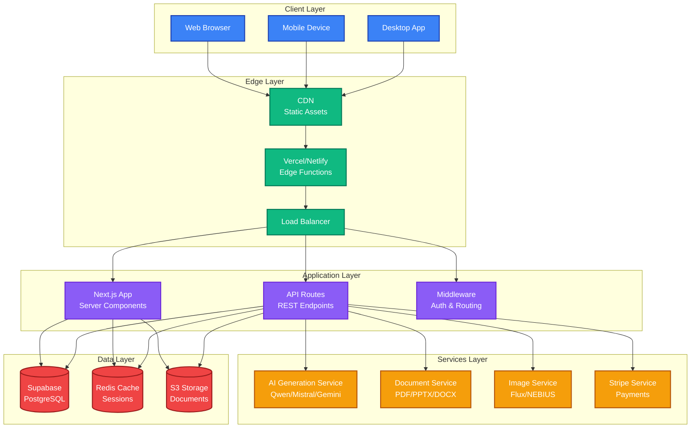
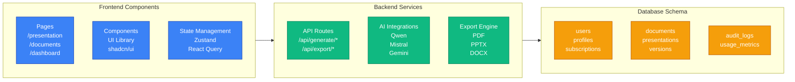
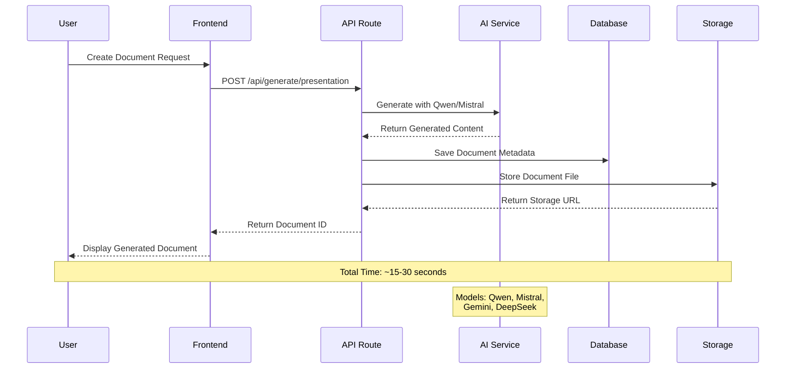
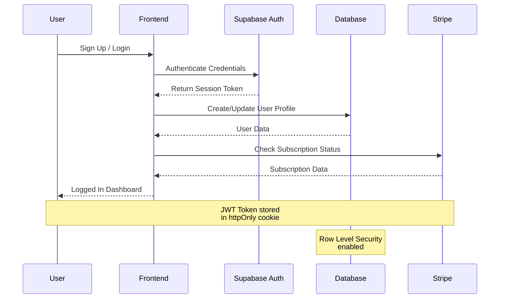
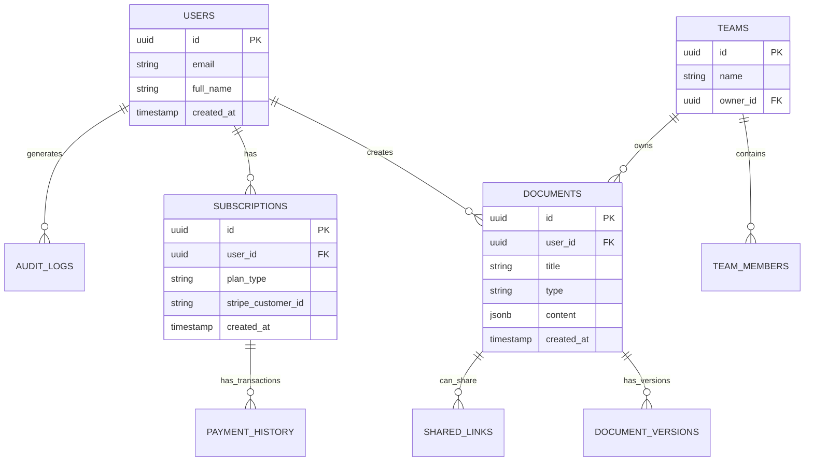
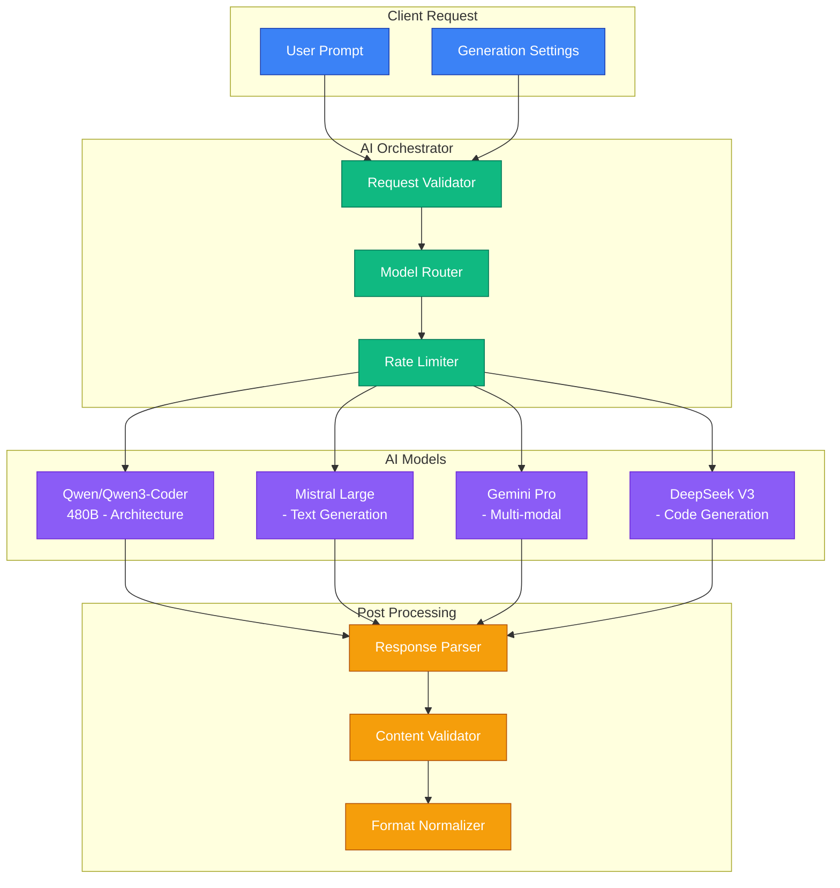
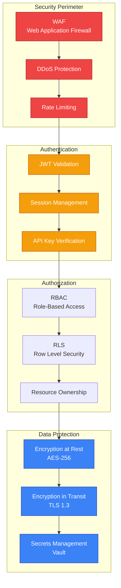
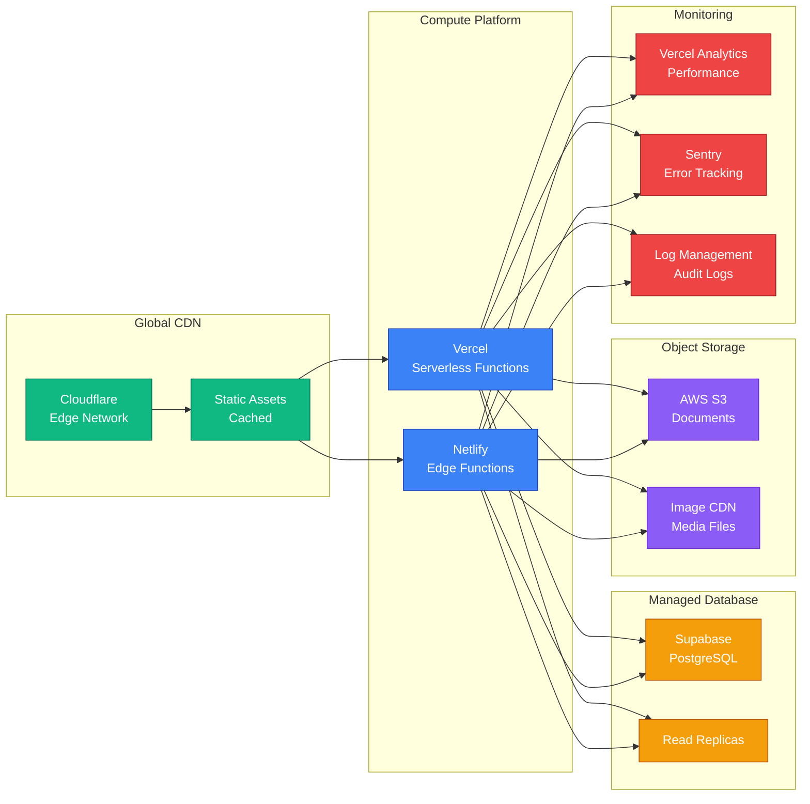

# 🏗️ DraftDeckAI System Architecture

## High-Level Architecture Overview

## Component Architecture

## Data Flow Architecture

### Document Generation Flow

### Authentication Flow

## Database Schema

## AI Integration Architecture

## Security Architecture

## Deployment Architecture

## Technology Stack

### Frontend
- **Framework**: Next.js 14 (App Router)
- **Language**: TypeScript 5
- **UI Library**: React 18 + shadcn/ui
- **State**: Zustand + TanStack Query
- **Styling**: Tailwind CSS
- **Charts**: Recharts
- **Diagrams**: Mermaid.js

### Backend
- **Runtime**: Node.js 20
- **API**: Next.js API Routes
- **Database**: Supabase (PostgreSQL)
- **Cache**: Redis (Upstash)
- **Storage**: AWS S3
- **Auth**: Supabase Auth

### AI/ML
- **Primary**: Qwen (Nebius)
- **Text**: Mistral Large
- **Multi-modal**: Gemini Pro
- **Code**: DeepSeek V3
- **Images**: Flux.1 (Nebius)

### DevOps
- **Hosting**: Vercel + Netlify
- **CDN**: Cloudflare
- **Monitoring**: Vercel Analytics + Sentry
- **CI/CD**: GitHub Actions

## Scalability Considerations

### Horizontal Scaling
- ✅ Stateless API functions
- ✅ Database connection pooling
- ✅ CDN for static assets
- ✅ Read replicas for database

### Vertical Scaling
- ✅ Serverless auto-scaling
- ✅ Database instance upgrades
- ✅ Cache layer for hot data

### Performance Optimization
- ✅ Edge caching
- ✅ Query optimization
- ✅ Lazy loading
- ✅ Code splitting

---

**Last Updated**: February 2026
**Architecture Version**: 2.0.0
