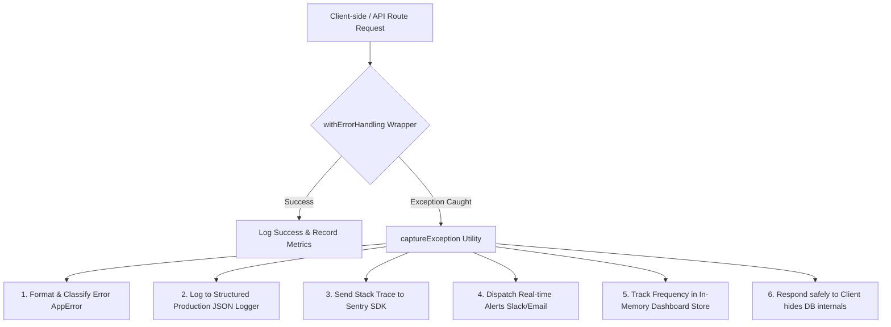

# 🛡️ Production-Grade Error Tracking, Auditing & Alerting System

This document outlines the architecture, setup, patterns, and usage guidelines for the centralized error tracking and alerting system implemented for **Draftdeckai**.

---

## 🎯 Architecture Overview

The system is designed to provide ubiquitous error capturing, precise debugging context, real-time Slack/Email alerts, and telemetry for the central Error Dashboard. It does this with zero third-party external dependencies in the base layer, with built-in dynamic bindings for **Sentry SDK** when active.



---

## 🛠️ Tech Stack & Integration Points

1.  **Central Handler (`lib/error-handler.ts`)**: The core engine of the error tracking ecosystem.
2.  **Mock Error Simulator (`app/api/error-test/route.ts`)**: An endpoint to trigger validation, unhandled exceptions, database connection errors, and rate-limiting spikes to test alert rules.
3.  **Telemetry Dashboard (`app/api/error-dashboard/route.ts`)**: Supplies real-time error rates, endpoint latencies, rolling rolling error logs, and system load data.
4.  **Sentry Next.js SDK**: Intercepts unhandled errors globally and uploads compiled source maps for stack trace translation.

---

## 🛡️ Error Classification System

All errors are classified into **Operational** (expected client errors) and **Non-Operational** (unexpected system crashes). We use a custom hierarchical `AppError` class inheriting from JavaScript's native `Error`:

| Error Class | HTTP Code | Machine Code | Operational? | Description |
| :--- | :--- | :--- | :--- | :--- |
| `ValidationError` | `400` | `VALIDATION_FAILED` | Yes | Request payload failed Zod schema checks. |
| `AuthenticationError` | `401` | `AUTHENTICATION_FAILED` | Yes | Token invalid, missing, or expired. |
| `ForbiddenError` | `403` | `FORBIDDEN` | Yes | User lacks permission to access the resource. |
| `NotFoundError` | `404` | `NOT_FOUND` | Yes | Resource not found in Supabase or system. |
| `RateLimitError` | `429` | `RATE_LIMIT_EXCEEDED` | Yes | Too many requests within window. |
| `AiServiceError` | `502` | `AI_SERVICE_FAILED` | Yes | Third-party AI model API (Mistral/Gemini) crashed. |
| `DatabaseError` | `500` | `DATABASE_ERROR` | No | Postgres/Supabase connection failed (internal). |

---

## 🚨 Alert Rules & Noise Grouping

To protect operators from **alert fatigue**, alerts are routed based on criticality:
1.  **Operational errors (4xx)** do **not** trigger alerts; they are only logged for analytics.
2.  **Non-operational errors (5xx/unexpected crashes)** trigger an alert.
3.  **Alert Grouping**: Identical errors are grouped by a unique composite ID (`Name-ErrorCode-Path`) so that identical failures generate only one aggregated notification per window.
4.  **System Spike Rule**: If the overall error rate across all routes exceeds **5%** in a rolling 1-minute window (minimum 20 requests), a `🔥 SYSTEM SPIKE ALERT` is triggered.

---

## 🔌 API Route Integration Pattern

To achieve **100% server-side API route coverage**, every route handler must be wrapped with the `withErrorHandling` higher-order wrapper.

### Step-by-Step Wrapper Migration

Instead of the standard Next.js export, wrap your handler like so:

```typescript
import { NextRequest, NextResponse } from 'next/server';
import { withErrorHandling, ValidationError } from '@/lib/error-handler';
import { z } from 'zod';

const bodySchema = z.object({
  topic: z.string().min(3),
});

// 1. Define your handler as an inner function (e.g. getHandler, postHandler)
async function postHandler(request: NextRequest) {
  const body = await request.json();

  // Zod validation checks
  const parsed = bodySchema.safeParse(body);
  if (!parsed.success) {
    // 2. Simply throw standard AppErrors! The wrapper will auto-capture, log and format them.
    throw new ValidationError('Validation failed: Topic is too short.');
  }

  // Business logic...
  return NextResponse.json({ success: true });
}

// 3. Export the handler wrapped with error-handling middleware
export const POST = withErrorHandling(postHandler);
```

### Why this is a game-changer for Developers:
*   **No more tedious try-catch blocks** or duplicate `NextResponse.json({ error: ... })` writing.
*   **Automatic Traceability**: Generates a standard `requestId` (UUID) or reads it from headers, attaching it to every single log entry and downstream Supabase call.
*   **Security by Default**: The wrapper automatically filters out internal database crash details in production, showing a friendly message to users while preserving the full stack trace in your internal logs for debugging.

---

## 🧪 Testing Mock Errors & Alert Routing

You can test the Sentry hooks and Slack alerts by hitting the dedicated simulator API endpoint:

1.  **Validation Error**:
    `GET /api/error-test?type=validation`
    *Returns 400 Bad Request with request ID and custom validation metadata.*
2.  **Unhandled Crash**:
    `GET /api/error-test?type=unhandled`
    *Simulates a null-pointer reference. Returns 500 and hides raw internal stack traces while logging the true error.*
3.  **Critical Database Timeout**:
    `GET /api/error-test?type=critical`
    *Simulates pool connection exhaustion. Triggers P1 alert.*
4.  **Error Spike Alarm Rule**:
    `GET /api/error-test?type=spike`
    *Generates 25 consecutive errors to breach the 5% error rate threshold. Check logs for the Spike Alert trigger.*

---

## 📊 Error Telemetry Dashboard API

The live telemetry dashboard can be monitored at `/api/error-dashboard`.
*   **Method**: `GET`
*   **Output**: Returns grouped error frequencies, resolution tags, endpoint error rates, and resource utilization (memory/load averages).
*   **Administration**: Send `POST /api/error-dashboard?action=reset` to wipe stats clean for a fresh test sweep.
